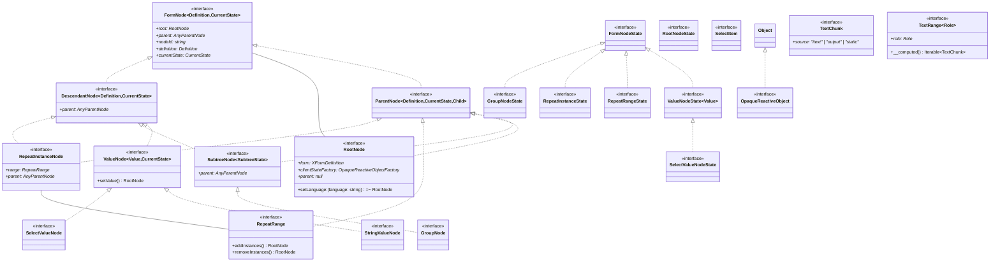

# Client Interface UML Diagram

```mermaid

classDiagram
class DescendantNode~Definition,CurrentState~ {
            <<interface>>
            +parent: AnyParentNode*
            
        }
FormNode~Definition,CurrentState~<|..DescendantNode~Definition,CurrentState~
class FormNode~Definition,CurrentState~ {
            <<interface>>
            +root: RootNode*
+parent: AnyParentNode*
+nodeId: string*
+definition: Definition*
+currentState: CurrentState*
            
        }
FormNode~Definition,CurrentState~  --  RootNode
class FormNodeState {
            <<interface>>
            
            
        }
class GroupNodeState {
            <<interface>>
            
            
        }
class GroupNode {
            <<interface>>
            
            
        }
FormNodeState<|..GroupNodeState
SubtreeNode~SubtreeState~<|..GroupNode
class ParentNode~Definition,CurrentState,Child~ {
            <<interface>>
            
            
        }
FormNode~Definition,CurrentState~<|..ParentNode~Definition,CurrentState,Child~
class RepeatInstanceState {
            <<interface>>
            
            
        }
class RepeatInstanceNode {
            <<interface>>
            +range: RepeatRange*
+parent: AnyParentNode*
            
        }
FormNodeState<|..RepeatInstanceState
DescendantNode~Definition,CurrentState~<|..RepeatInstanceNode
ParentNode~Definition,CurrentState,Child~<|..RepeatInstanceNode
RepeatInstanceNode  --  RepeatRange
class RepeatRangeState {
            <<interface>>
            
            
        }
class RepeatRange {
            <<interface>>
            
            +addInstances() RootNode
+removeInstances() RootNode
        }
FormNodeState<|..RepeatRangeState
ParentNode~Definition,CurrentState,Child~<|..RepeatRange
class RootNodeState {
            <<interface>>
            
            
        }
class RootNode {
            <<interface>>
            +form: XFormDefinition*
+clientStateFactory: OpaqueReactiveObjectFactory*
+parent: null*
+setLanguage: (language: string) =~ RootNode
            
        }
ParentNode~Definition,CurrentState,Child~<|..RootNode
class SelectItem {
            <<interface>>
            
            
        }
class SelectValueNodeState {
            <<interface>>
            
            
        }
class SelectValueNode {
            <<interface>>
            
            
        }
ValueNodeState~Value~<|..SelectValueNodeState
ValueNode~Value,CurrentState~<|..SelectValueNode
class StringValueNode {
            <<interface>>
            
            
        }
ValueNode~Value,CurrentState~<|..StringValueNode
class SubtreeNode~SubtreeState~ {
            <<interface>>
            +parent: AnyParentNode*
            
        }
DescendantNode~Definition,CurrentState~<|..SubtreeNode~SubtreeState~
ParentNode~Definition,CurrentState,Child~<|..SubtreeNode~SubtreeState~
class ValueNodeState~Value~ {
            <<interface>>
            
            
        }
class ValueNode~Value,CurrentState~ {
            <<interface>>
            
            +setValue() RootNode
        }
FormNodeState<|..ValueNodeState~Value~
DescendantNode~Definition,CurrentState~<|..ValueNode~Value,CurrentState~
class OpaqueReactiveObject {
            <<interface>>
            
            
        }
Object<|..OpaqueReactiveObject
class TextChunk {
            <<interface>>
            +source: "itext" | "output" | "static"*
            
        }
class TextRange~Role~ {
            <<interface>>
            +role: Role*
            +__computed() Iterable~TextChunk~
        }
```