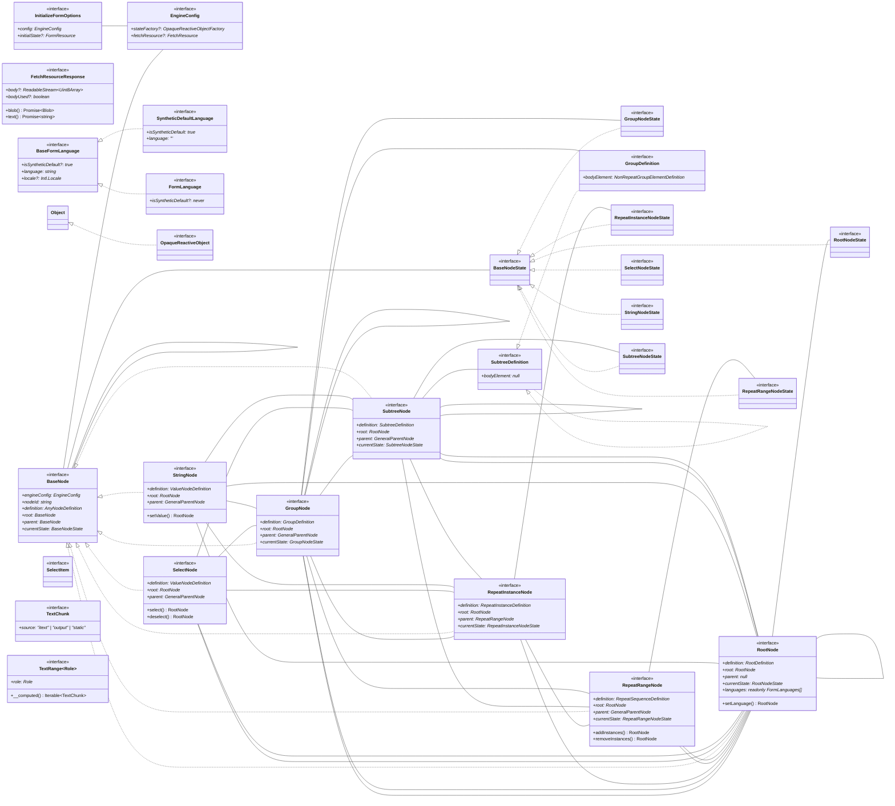

# Client Interface UML Diagram

```mermaid

classDiagram
direction LR
class BaseNodeState {
            <<interface>>
            
            
        }
class BaseNode {
            <<interface>>
            +engineConfig: EngineConfig*
+nodeId: string*
+definition: AnyNodeDefinition*
+root: BaseNode*
+parent: BaseNode*
+currentState: BaseNodeState*
            
        }
BaseNode  --  EngineConfig
BaseNode  --  BaseNode
BaseNode  --  BaseNodeState
class FetchResourceResponse {
            <<interface>>
            +body?: ReadableStream~Uint8Array~*
+bodyUsed?: boolean*
            +blob() Promise~Blob~
+text() Promise~string~
        }
class EngineConfig {
            <<interface>>
            +stateFactory?: OpaqueReactiveObjectFactory*
+fetchResource?: FetchResource*
            
        }
class BaseFormLanguage {
            <<interface>>
            +isSyntheticDefault?: true*
+language: string*
+locale?: Intl.Locale*
            
        }
class SyntheticDefaultLanguage {
            <<interface>>
            +isSyntheticDefault: true*
+language: ""*
            
        }
class FormLanguage {
            <<interface>>
            +isSyntheticDefault?: never*
            
        }
BaseFormLanguage<|..SyntheticDefaultLanguage
BaseFormLanguage<|..FormLanguage
class GroupNodeState {
            <<interface>>
            
            
        }
class GroupDefinition {
            <<interface>>
            +bodyElement: NonRepeatGroupElementDefinition*
            
        }
class GroupNode {
            <<interface>>
            +definition: GroupDefinition*
+root: RootNode*
+parent: GeneralParentNode*
+currentState: GroupNodeState*
            
        }
BaseNodeState<|..GroupNodeState
SubtreeDefinition<|..GroupDefinition
BaseNode<|..GroupNode
GroupNode  --  GroupDefinition
GroupNode  --  RootNode
GroupNode  --  RootNode
GroupNode  --  SubtreeNode
GroupNode  --  GroupNode
GroupNode  --  RepeatInstanceNode
GroupNode  --  GroupNodeState
class InitializeFormOptions {
            <<interface>>
            +config: EngineConfig*
+initialState?: FormResource*
            
        }
InitializeFormOptions  --  EngineConfig
class OpaqueReactiveObject {
            <<interface>>
            
            
        }
Object<|..OpaqueReactiveObject
class RepeatInstanceNodeState {
            <<interface>>
            
            
        }
class RepeatInstanceNode {
            <<interface>>
            +definition: RepeatInstanceDefinition*
+root: RootNode*
+parent: RepeatRangeNode*
+currentState: RepeatInstanceNodeState*
            
        }
BaseNodeState<|..RepeatInstanceNodeState
BaseNode<|..RepeatInstanceNode
RepeatInstanceNode  --  RootNode
RepeatInstanceNode  --  RepeatRangeNode
RepeatInstanceNode  --  RepeatInstanceNodeState
class RepeatRangeNodeState {
            <<interface>>
            
            
        }
class RepeatRangeNode {
            <<interface>>
            +definition: RepeatSequenceDefinition*
+root: RootNode*
+parent: GeneralParentNode*
+currentState: RepeatRangeNodeState*
            +addInstances() RootNode
+removeInstances() RootNode
        }
BaseNodeState<|..RepeatRangeNodeState
BaseNode<|..RepeatRangeNode
RepeatRangeNode  --  RootNode
RepeatRangeNode  --  RootNode
RepeatRangeNode  --  SubtreeNode
RepeatRangeNode  --  GroupNode
RepeatRangeNode  --  RepeatRangeNodeState
class RootNodeState {
            <<interface>>
            
            
        }
class RootNode {
            <<interface>>
            +definition: RootDefinition*
+root: RootNode*
+parent: null*
+currentState: RootNodeState*
+languages: readonly FormLanguages[]*
            +setLanguage() RootNode
        }
BaseNodeState<|..RootNodeState
BaseNode<|..RootNode
RootNode  --  RootNode
RootNode  --  RootNodeState
class SelectItem {
            <<interface>>
            
            
        }
class SelectNodeState {
            <<interface>>
            
            
        }
class SelectNode {
            <<interface>>
            +definition: ValueNodeDefinition*
+root: RootNode*
+parent: GeneralParentNode*
            +select() RootNode
+deselect() RootNode
        }
BaseNodeState<|..SelectNodeState
BaseNode<|..SelectNode
SelectNode  --  RootNode
SelectNode  --  RootNode
SelectNode  --  SubtreeNode
SelectNode  --  GroupNode
SelectNode  --  RepeatInstanceNode
class StringNodeState {
            <<interface>>
            
            
        }
class StringNode {
            <<interface>>
            +definition: ValueNodeDefinition*
+root: RootNode*
+parent: GeneralParentNode*
            +setValue() RootNode
        }
BaseNodeState<|..StringNodeState
BaseNode<|..StringNode
StringNode  --  RootNode
StringNode  --  RootNode
StringNode  --  SubtreeNode
StringNode  --  GroupNode
StringNode  --  RepeatInstanceNode
class SubtreeNodeState {
            <<interface>>
            
            
        }
class SubtreeDefinition {
            <<interface>>
            +bodyElement: null*
            
        }
class SubtreeNode {
            <<interface>>
            +definition: SubtreeDefinition*
+root: RootNode*
+parent: GeneralParentNode*
+currentState: SubtreeNodeState*
            
        }
BaseNodeState<|..SubtreeNodeState
SubtreeDefinition<|..SubtreeDefinition
BaseNode<|..SubtreeNode
SubtreeNode  --  SubtreeDefinition
SubtreeNode  --  RootNode
SubtreeNode  --  RootNode
SubtreeNode  --  SubtreeNode
SubtreeNode  --  RepeatInstanceNode
SubtreeNode  --  SubtreeNodeState
class TextChunk {
            <<interface>>
            +source: "itext" | "output" | "static"*
            
        }
class TextRange~Role~ {
            <<interface>>
            +role: Role*
            +__computed() Iterable~TextChunk~
        }
```